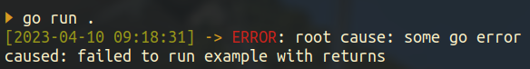
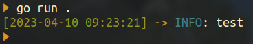

# Glogger

A simple Error & Logging library for Golang

## Quick Start

Example:

```
func SimpleLog(log Loggable) {
	logger := CreateSimpleConsoleLogger(
		func(a ...any) {
			fmt.Print(a...)
		},
	)
	logger.Error(log)
}

func SomeError() Err {
	return NewError(errors.New("some go error")).
		Caused("failed to run example with returns").
		LogIfErr(SimpleLog)
}
```

Output:




## Errors

#### Adds a simple wrapper on golang base errors, with some builder patterns to extend the stack trace

```
baseErr := errors.New("some error")
err := NewError(baseErr)
```

#### Allows for some simple chaining of causes:

Given a function from some standard function, you can expect a go `error` back.
When returning in your own function, you can return an `Err` by wrapping the error before bubbling it up:

`NewError(err).Caused("failed to run example with returns").LogIfErr(SimpleLog)`

This adds a side effect caused description to the stack, and logs if there was an error.
If there was no error, no log is produced, and an `EmptyErr` is returned.


Here is a full example,
```
func ExampleWithReturns() (string, Err) {
	res, err := SomeFuncWithReturns()
	if err != nil {
		return "", NewError(err).Caused("failed to run example with returns").LogIfErr(SimpleLog)
	}
	return res, EmptyErr()
}
```

`LogIfErr` takes an `Err` and logs if the `baseErr` is not `nil`. 
It takes a function of type `func (Loggable)` as a argument, where `Loggable` is an interface with an `Error() string` function.


## Logging

This library provides a simple customizable logging kit.

### Simple Logger

The simplest start is to use the constructor:

`CreateSimpleConsoleLogger(func(...any))`

The function required is the logging function, for example:
```
logger := CreateSimpleConsoleLogger(func(args ...any) {
    fmt.Fprintln(buffer, args...)
})
```
which will log any errors to the buffer when ran.

The logger provides three functions,

`Error(Loggable)`

`Info(Loggable)`

`Debug(Loggable)`

These just set the level to log at.

Example Log:
```
[2023-04-10 09:07:08] -> ERROR: root cause: some failure
caused: failed to run example with returns
```

### Customization

The logger can be further customized with different constructors,

For Example:
`CreateFormattedLogger(logFormat string, logFunc func(...any)`
lets you customize the `logFormat`, 

This is a string that provides how the log should look like. There are several options to use:

Example:
`[green][date][reset] [yellow]->[reset] [level]: [log]`

Each component in square brackets will get replaced, where `[log]` is the log string, `[date]` will get replaced by current date and time, and `[yellow]` will set all future text yellow until `[reset]` is added.

The options are:
* `[level]`
    * Replaced with the Level set to upper case and colorized if `LevelColor` is `true`, following `LevelColors` map
* `[date]`
    * Replaced with current datetime follow `DateFormat` format
* `[log]`
    * Replaced with the actual log message
* Colors:
    * `[red]`
    * `[green]`
    * `[magenta]`
    * `[blue]`
    * `[yellow]`
    * `[reset]`
        * Resets the color to default

### Fully custom logger

This constructor let's you customize more of the logger.

`CreateConsoleLogger(dateFormat, logFormat string, levelColors map[string]string, logFunc func(...any))`

The dateformat is a string for how to display the time, and follows `Time.time` format.

levelColors is a map showing which colors each level should be.

Example:
```
logger := CreateConsoleLogger(
    "2006-01-02",
    "[date]: [log]",
    map[string]string{
        "error": "red",
        "info": "blue",
    },
    func(args ...interface{}) {
        fmt.Fprintln(buffer, args...)
    },
)
```

### Logging Strings

To log a string, it needs to implement `Loggable`.

This can be easily done using the `Str()` function, for example:

```
logger := CreateSimpleConsoleLogger(
    func(a ...any) {
        fmt.Println(a...)
    },
)

log.Info(Str("test"))
```

Output:


